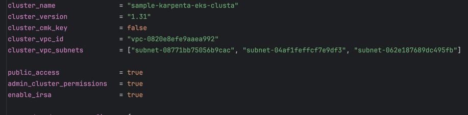

# AWS EKS cluster setup with Karpenter Autoscaler to create Graviton and x86 Spot instances

These Terraform automation will deploy an AWS EKS cluster in any specified AWS Region. 

## Features
Nodepools and nodeclasses both for arm64 and x86 will be deployed. IRSA will use for 
generation of sts tokens that will be use to access EC2 and spot AWS service control planes.

## Pre-requisites
Following binaries and access are needed on the automation system/pc.

* awscli version 2 (2.22.16) and later.
* kubectl (1.26) and later.
* terraform (1.8.0) and later.
* Access to internet in order to download terraform providers and modules.

### **Usage Steps** 

1. Clone this Repository.
```
git clone https://github.com/jomojowo/Karpenta-eks-clusta.git
cd Karpenta-eks-clusta/
```

2. Pass in your values to following variables in tfvars file: "variables\eks_initialization_test_recommended.tfvars.tf"

Explanation:

- cluster_name: name of eks new cluster that will be created.
- cluster_version: eks cluster version that be use.
- cluster_vpc_id: eks vpc id that will be use for networking.
- cluster_vpc_subnets: eks private subnets that will use for networking.
- public_access: true/false, if public access is needed.
- admin_cluster_permissions: true/false, if the IAM user/role use to create eks cluster need's admin rights on cluster. 

Example below: 



3. Download terraform providers and modules. 
```
terraform init -upgrade -reconfigure
```
4. Generate terraform plan file that will be applied to EKS service, so as to create new EKS cluster and it's resources. 
```
terraform plan -var-file=variables/eks_initialization_test_recommended.tfvars.tf  -out=test-plan
```
5. Apply generated terraform plan. Please note: if application of terraform plan failed. Re-run steps 4 and 5 again.
```
terraform apply "test-plan"
```

KEYWORD for Graviton (arm64) Deployment manifest(s): 
```
    kubernetes.io/arch: arm64
```
KeyWord for x86 (amd64) Deployment manifest(s):
```
      affinity:
        nodeAffinity:
          requiredDuringSchedulingIgnoredDuringExecution:
            nodeSelectorTerms:
              - matchExpressions:
                - key: "opsfleet-team"
                  operator: "In"
                  values: ["team-X"]
```

6. Testing keyWords with sample deployments in examples folder, i.e., nginx-x86.yaml, graviton-inflate.yaml
Create/update $Home/.kube/config file with new EKS cluster kubeconfig. Replace "<cluster_name>" with cluster name passed in step 2.
```
aws eks --region eu-west-1 update-kubeconfig --name "<cluster_name>"
```
7. Apply sample deployment manifests in the examples folder and restart karpenter-controllers deployment.
```
kubectl apply -f examples/nginx-x86.yaml
kubectl apply -f examples/graviton-inflate.yaml
kubectl rollout restart deployment/karpenter-controllers -n kube-system
```
Step 7: Will create new spot instances both for x86 and graviton deployments.

## Cleanup Steps (Optional)

1. Delete x86 and Graviton deployment(s), which will lead to termination of running spot instance(s) hosting the deployment pod(s).
Example deployments used in the below command.
```
kubectl delete -f examples/nginx-x86.yaml
kubectl delete -f examples/graviton-inflate.yaml
```

2. Run Terraform destroy command with automatic approval to destroy all created resources.
```
terraform destroy -auto-approve -var-file=variables/eks_initialization_test_recommended.tfvars.tf
```